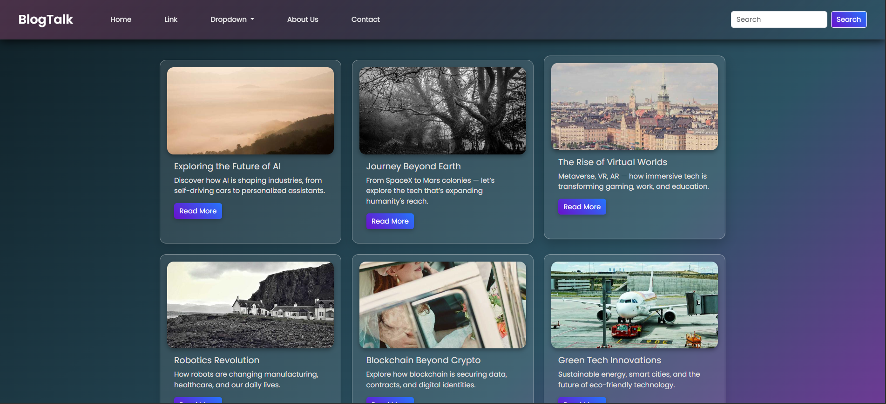

# 🌐 Futuristic Blog

A responsive and modern blog layout designed using **HTML**, **CSS**, and **Bootstrap 5**. This futuristic-themed UI presents blog posts with sleek cards, a glassmorphism-inspired navbar, and a clean footer with social media links.

---

## ✨ Features

- Responsive layout with Bootstrap 5 Grid
- Glassmorphism-style fixed navbar
- Search bar and collapsible mobile navigation
- Blog cards with hover effects
- Modern color gradients and shadows
- Responsive footer with social media icons
- Bootstrap icons integration
- Google Fonts (`Poppins`)

---

## 🔧 Technologies Used

| Tech            | Usage                                      |
|-----------------|---------------------------------------------|
| **HTML5**       | Markup structure of the blog page          |
| **CSS3**        | Custom styling, gradients, blur effects     |
| **Bootstrap 5** | Grid system, responsive navbar, buttons     |
| **Bootstrap Icons** | Icons for social media and UI            |
| **Google Fonts** | Custom font (`Poppins`) for modern look   |
| **Picsum Photos** | Random placeholder blog images             |

---

## 📁 File Structure

```
/
├── index.html
├── README.md
```

_All styles are written directly in the `<style>` tag inside `index.html`. No separate CSS or JS files are used._

---

## 🔍 Live Preview

You can preview the blog page by simply opening `index.html` in your browser.

Alternatively, host it using:

- **GitHub Pages**
- **Netlify**
- **Vercel**

---

## 🖼️ Screenshots

> 

---

## 📦 Setup Instructions

1. **Clone the repository:**
   ```
   git clone https://github.com/yourusername/futuristic-blog.git
   cd futuristic-blog
2. **Open the project in your preferred code editor.**
3. **Launch index.html in a web browser:**
    ```bash
    open index.html
    ```
_No build tools or installations are required — it’s a pure frontend project._

---
## 🧠 Customization Ideas
- Add blog data dynamically using JavaScript or fetch from a CMS.

- Implement a light/dark mode switch.

- Add animations using AOS.

- Enable search functionality.

- Turn it into a full blog site with multiple pages.

---
## 🤝 Credits
- Bootstrap 5

- Bootstrap Icons

- Google Fonts - Poppins

- Picsum Photos for blog images -> [Link](https://picsum.photos/)

---
## 🙏 Acknowledgements

- 🚀 Built as a frontend project to sharpen skills in **HTML**, **CSS**, and **Bootstrap 5**.
- 🌌 Designed with the aim of creating a **visually engaging blog layout** featuring cards, a responsive navbar, and a modern footer.
- 🎨 Inspired by futuristic UI trends, gradients, glassmorphism, and interactive design.
- 💡 This project helped me improve my understanding of:
  - Responsive design with Bootstrap grid system
  - Styling with gradients, blur, shadows, and animations
  - Component layout using cards and modals
  - Integration of **Bootstrap Icons** and **Google Fonts**
- 📦 Enhanced my confidence in building aesthetic, production-ready UI with only HTML/CSS/Bootstrap.

---

## 👨‍💻 Author

Made with ❤️ by [Rishabh](https://github.com/RishabhMunakhiya)

💼 [LinkedIn](https://www.linkedin.com/in/rishabh-dtu27/)  | 💻 [GitHub](https://github.com/RishabhMunakhiya)


